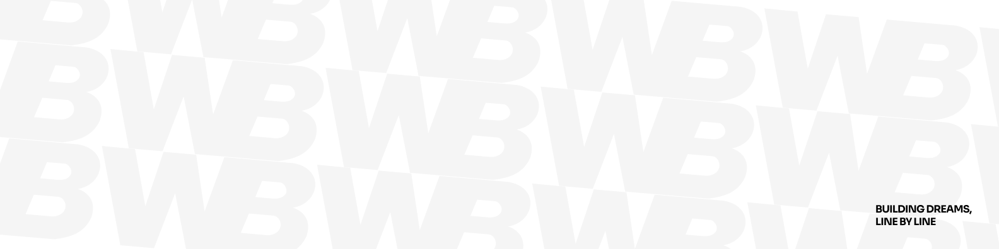

**William**

full-stack developer with 7+ years across web, infrastructure, and networking. i build performant, well-architected products — from design systems and storefronts to microservices and self-hosted infrastructure. comfortable across the whole stack and at home in a terminal.

[bnhm.dev](https://bnhm.dev) · [linkedin](https://www.linkedin.com/in/william-banham/) · [will@bnhm.dev](mailto:will@bnhm.dev)

---

### stack

---

### projects

<table>
  <tr>
    <td width="50%" valign="top">
      <h4><a href="https://github.com/wrlliam/bnhm.dev">bnhm.dev</a></h4>
      personal
        
      
Personal portfolio and digital home. Built with a focus on performance and design — a living showcase of current work and thinking.

      

        
        
        
      

    </td>
    <td width="50%" valign="top">
      <h4><a href="https://github.com/rundigi/digi">rundigi / digi</a></h4>
      open source
        
      
Modular microservices platform and infrastructure toolkit for modern web deployments. Designed for composability and self-hosting.

      

        
        
        
      

    </td>
  </tr>
  <tr>
    <td width="50%" valign="top">
      <h4><a href="https://github.com/wrlliam/mylo">mylo</a></h4>
      mobile
        
      
A mobile app that turns household chores into a rewarding experience for kids — habit tracking with points, streaks, and rewards built in.

      

        
        
        
      

    </td>
    <td width="50%" valign="top">
      <h4><a href="https://github.com/wrlliam/stratum-shop">stratum-shop</a></h4>
      e-commerce
        
      
Full-featured e-commerce platform tailored for 3D printing services — product configuration, order management, and storefront in one.

      

        
        
        
      

    </td>
  </tr>
</table>